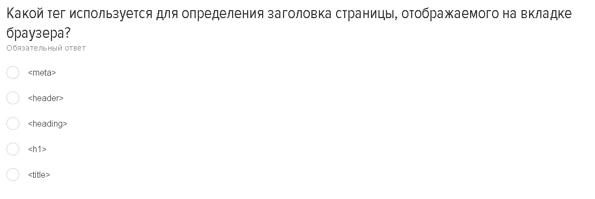
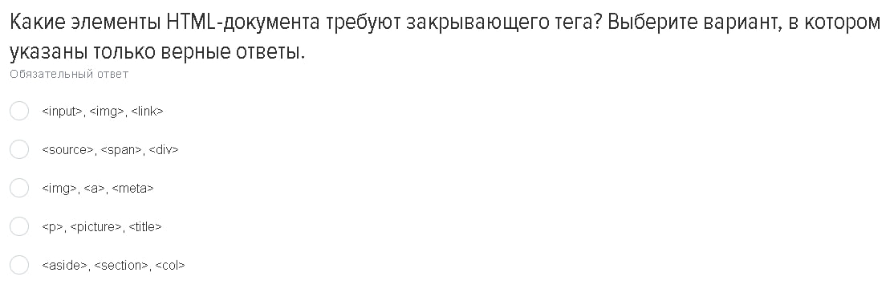
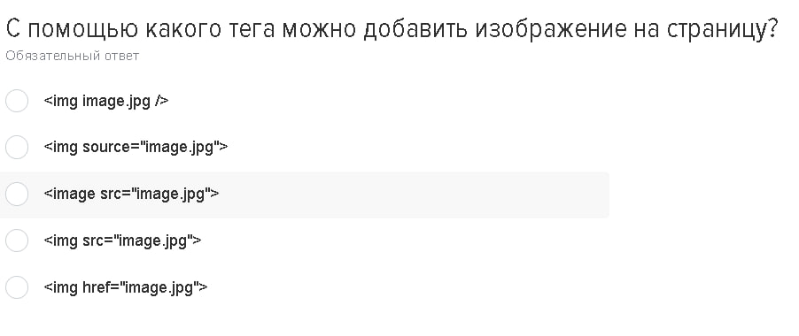
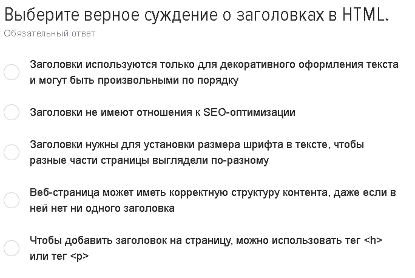
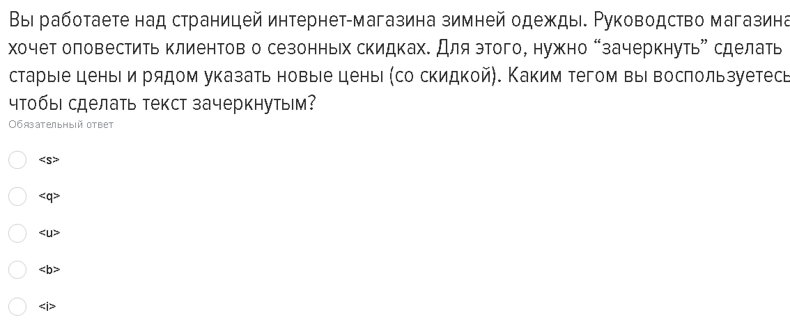
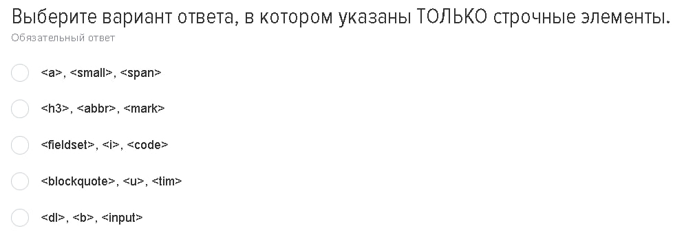
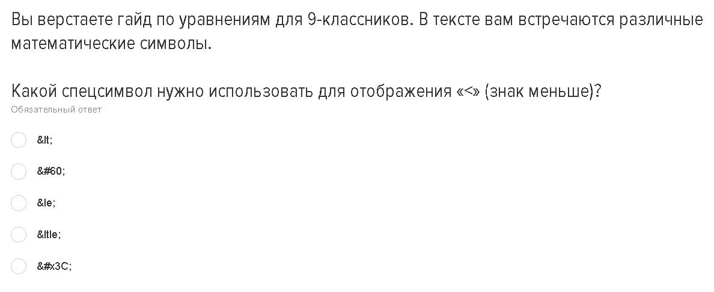
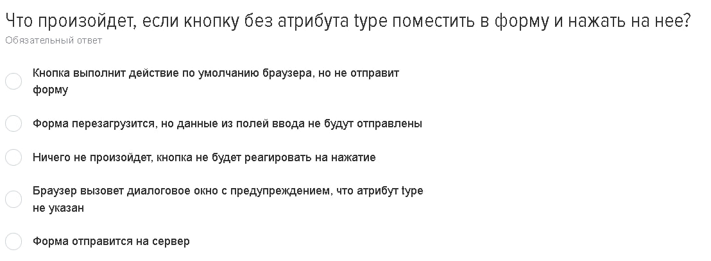
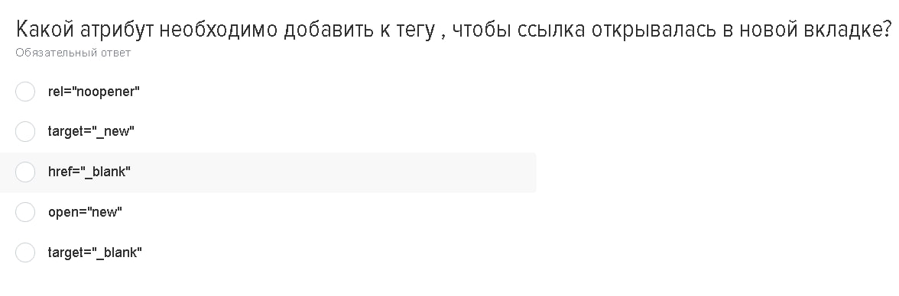
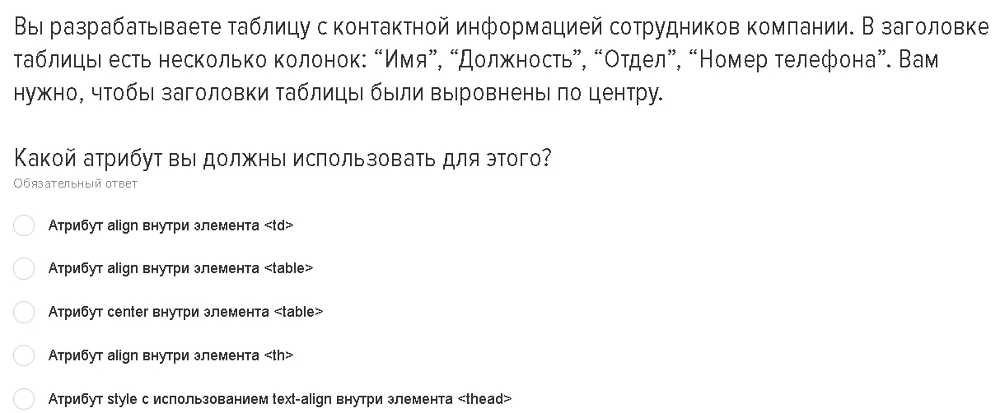

# Теория
# Вопросы и Ответы

В этом разделе представлены 10 изображений с вопросами. Нажмите на ответы, чтобы увидеть ответы и объяснения.

1. 
   

   
Ответ

   title
   

---
2. 
   

   
Ответ

   p, picture, title
   

---
3. 
   

   
Ответ

    img src='image.jpg'
   

---
4. 
   

   
Ответ

   Веб-страница может иметь корректную структуру контента, даже если в ней нет ни одного заголовка
   

---
5. 
   

   
Ответ

   s

   

---
6. 
   

   
Ответ

    a, small, span
   

---
7. 
   

   
Ответ

   
   - спец символ для отображения знака меньше - &lt,
   - спец символ для отображения знака больше - &gt,
  
   

---
8. 
   

   
Ответ

    Форма отправиться на сервер
   

---
9. 
   

   
Ответ

    target="_blank" - открывает ссылку в новом окне
   

---
10. 
   

   
Ответ

   Атрибут align внутри элемента th определяет выравнивание содержимого ячейки по центру 
   

---
