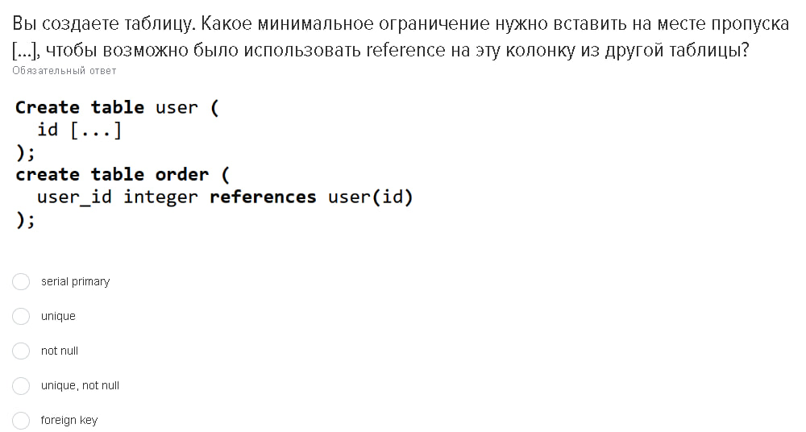

# Теория
# Вопросы и Ответы

В этом разделе представлены 9 изображений с вопросами. Нажмите на ответы, чтобы увидеть ответы и объяснения.

1. 
   

   
Ответ

   json
   

---
2. 
   

   
Ответ

   integer check(age>0)
   

---
3. 
   

   
Ответ

   Подойдёт запрос: alter table some_table alter column id type bigserial
   Объяснение: alter table - изменение структуры таблицы, alter column - изменение структуры одного столбца
   

---
4. 
   

   
Ответ

   alter table person add column fullname text generated always as (first_name || ' ' || second_name) stored
   
   

---
5. 
   

   
Ответ

   Последовательность 'my_sequence'
   

---
6. 
   

   
Ответ

   limit и offset.
   Пагинация - это механизм, который используется для упрощения работы с большими данными. Суть которого в том, что мы делаем выборку не из всех данных, а из определенного количества.
   limit - в пагинации выполняет роль поиска нескольких элементов в таблице.
   offset - в пагинации выполняет роль сдвига на определенное количество элементов в таблице.
   

---
7. 
   

   
Ответ

   901, 902, 903
   

---
8. 
   

   
Ответ

   reference - в бд это ссылка на другую таблицу
    PRIMARY KEY (то есть  unique, not null)
   

---
9. 
   

   
Ответ

   ON DELETE RESTRICT
   RESTRICT отличается от CASCADE тем, что она запрещает удаление, если есть связанные данные в других таблицах.
   А CASCADE удаляет данные вместе с связанными данными.
   

---