# Теория
# Вопросы и Ответы

В этом разделе представлены 16 изображений с вопросами. Нажмите на ответы, чтобы увидеть ответы и объяснения.

1. 
   

   
Ответ

   Для хранения списка IP-адресов в Python лучше всего подходит тип данных (список). Списки позволяют хранить упорядоченные коллекции элементов и предоставляют возможность их изменять, что удобно для работы с множеством IP-адресов.
   

---
2. 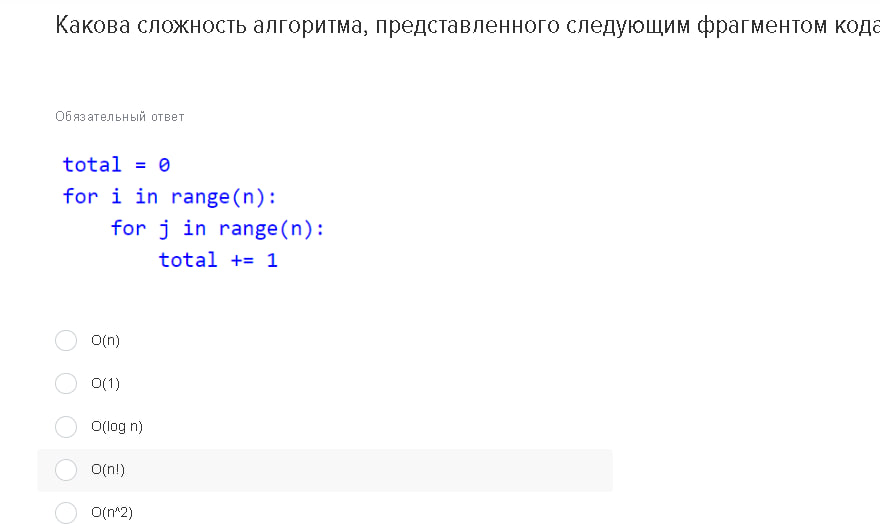
   

   
Ответ

   Данный алгоритм содержит два вложенных цикла, каждый из которых выполняется ( n ) раз. Это делает общую сложность алгоритма O(n^2). 

    Правильный вариант ответа: O(n^2).
   

---
3. 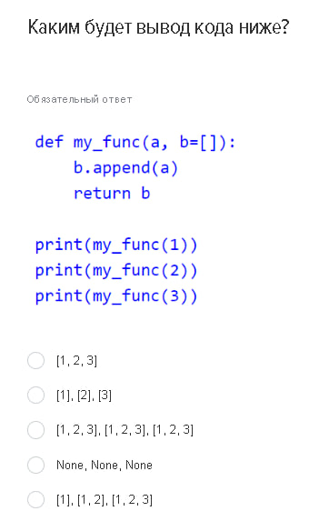
   

   
Ответ

   Функция my_func использует изменяемый объект (список) в качестве значения по умолчанию для аргумента b. Это приводит к тому, что все вызовы функции используют один и тот же список.
   Правильный вариант ответа: [1], [1, 2], [1, 2, 3].
   

---
4. 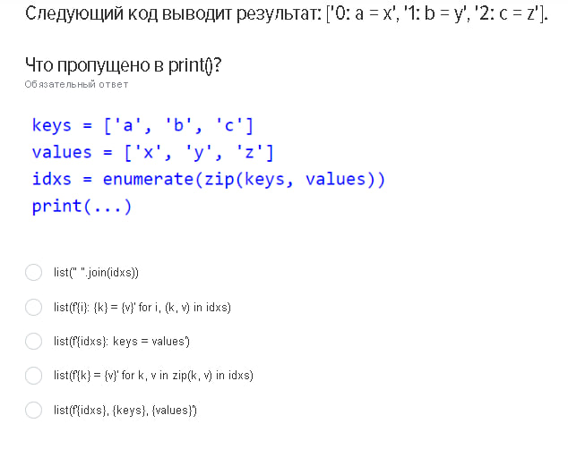
   

   
Ответ

   Правильный вариант ответа: 

   list(f"{i}: {k} = {v}" for i, (k, v) in idxs)
   Это создаст список строк, в которых каждый элемент формируется как "{i}: {k} = {v}" для каждого индекса, ключа и значения.
   

---
5. 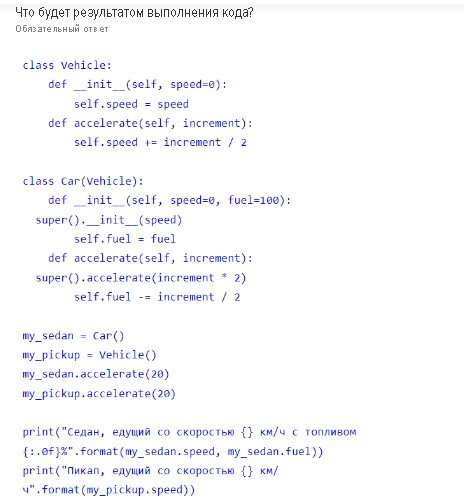
   

   
Ответ

   Седан едущий со скоростью 20.0 км/ч с топливом 90%
   Пикап едущий со скоростью 10.0 км/ч
   

---
6. 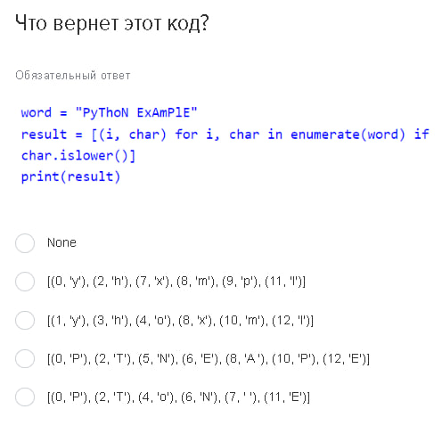
   

   
Ответ

   Код создаёт список кортежей, где каждый кортеж содержит индекс и символ из строки word
   [(1, 'y'), (3, 'h'), (4, 'o'), (8, 'x'), (10, 'm'), (12, 'l')]
   

---
7. 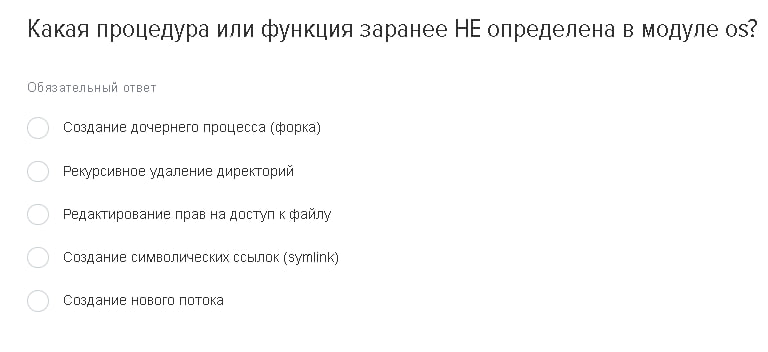
   

   
Ответ

   Это создание нового потока. Потоки используются для выполнения асинхронных операций в параллельном режиме. 
   

---
8. 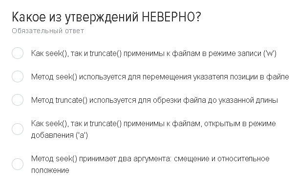
   

   
Ответ

    Неверное утверждение:
    (Как seek(), так и truncate() применимы к файлам в режиме записи ('w').)

    Это утверждение неверно, так как truncate() может быть применено, но seek() в режиме 'w' перемещает указатель только до текущего конца файла, так как файл открывается как пустой.

---
9. 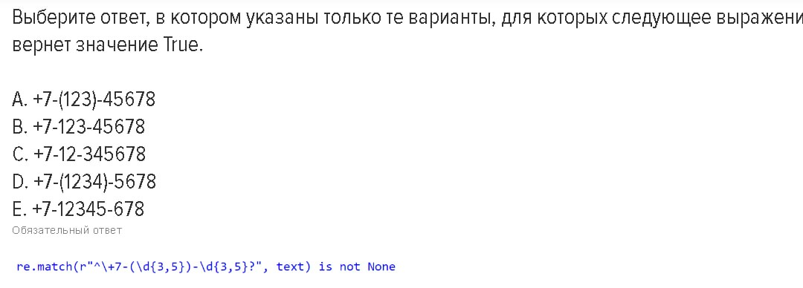
   

   
Ответ

   B, E соответствуют шаблону
   

---
10. 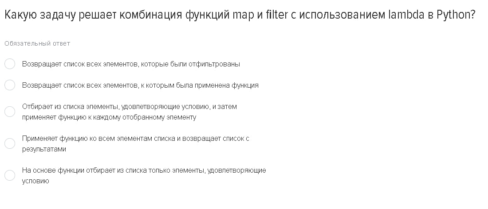
    

    
Ответ

    Комбинация функций map и filter с использованием lambda в Python позволяет:

    - Обработать список и вернуть новый список, где элементы преобразованы и/или отфильтрованы на основе заданных условий.
    

---
11. 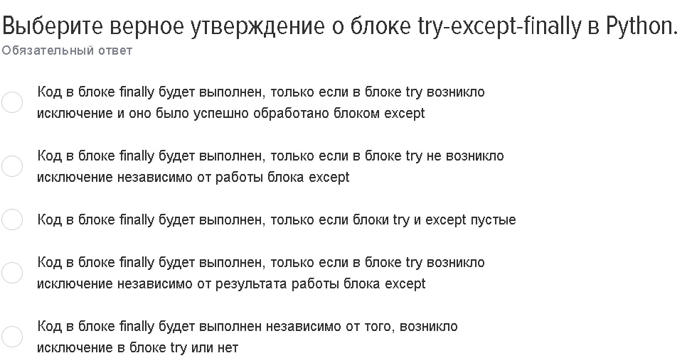
    

    
Ответ

    Код в блоке finally будет выполнен в любом случае, независимо от того, возникло исключение в блоке try или или нет.
    

---
12. 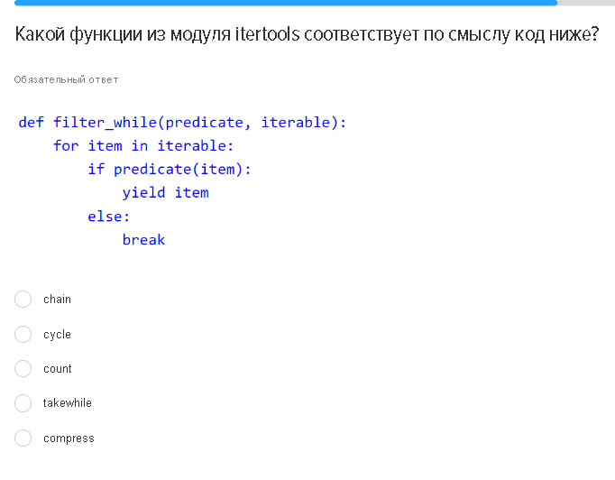
    

    
Ответ

    На takewhile() создается итератор, который будет возвращать элементы из исходного итератора, пока условие истинно.
    

---
13. 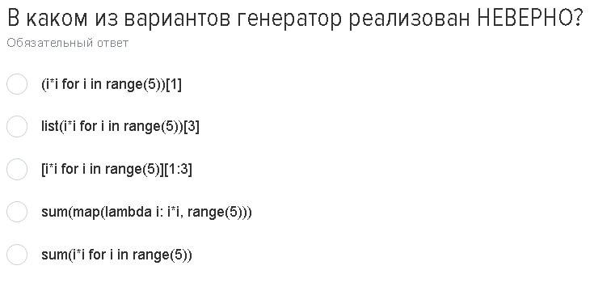
    

    
Ответ

    Генераторы нельзя индексировать. 
    (i*i for i in range(5))[1]
    

---
14. 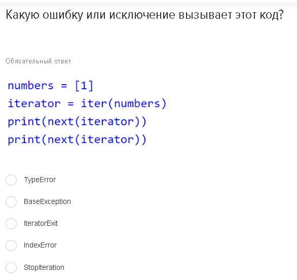
    

    
Ответ

    StopIteration (Так как элементов больше нет)
    

---
15. 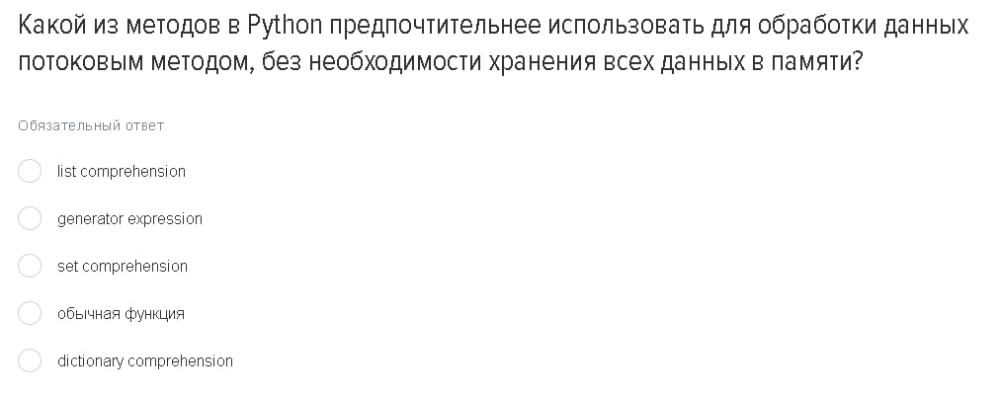
    

    
Ответ

    Генераторные выражения создают элементы по одному за раз, не загружая все данные в память.

    generator expression.
    

---
16. 
    

    
Ответ

    - multiprocessing.Pool

    Этот инструмент позволяет распределять задачи по нескольким процессорам.
    

