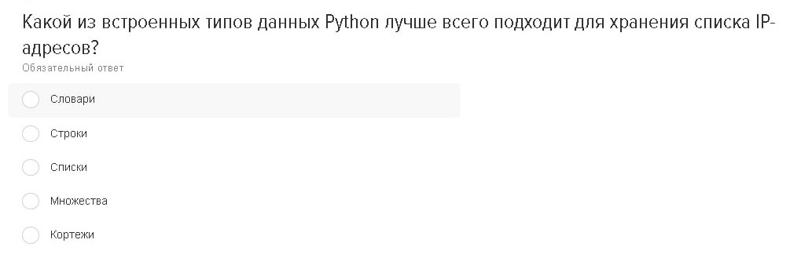
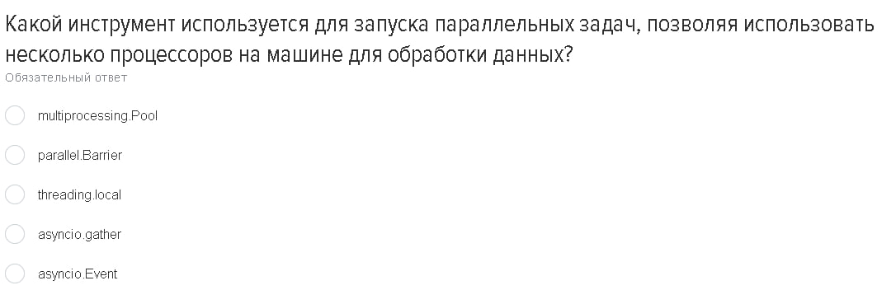

# Теория
# Вопросы и Ответы

В этом разделе представлены 16 изображений с вопросами. Нажмите на ответы, чтобы увидеть ответы и объяснения.

## Вопросы

1. 
   

   
Ответ

   Ответ на вопрос 1 с объяснением.
   

2. 
   

   
Ответ

   Ответ на вопрос 2 с объяснением.
   

3. 
   

   
Ответ

   Ответ на вопрос 3 с объяснением.
   

4. 
   

   
Ответ

   Ответ на вопрос 4 с объяснением.
   

5. 
   

   
Ответ

   Ответ на вопрос 5 с объяснением.
   

6. 
   

   
Ответ

   Ответ на вопрос 6 с объяснением.
   

7. 
   

   
Ответ

   Ответ на вопрос 7 с объяснением.
   

8. 
   

   
Ответ

   Ответ на вопрос 8 с объяснением.
   

9. 
   

   
Ответ

   Ответ на вопрос 9 с объяснением.
   

10. 
    

    
Ответ

    Ответ на вопрос 10 с объяснением.
    

11. 
    

    
Ответ

    Ответ на вопрос 11 с объяснением.
    

12. 
    

    
Ответ

    Ответ на вопрос 12 с объяснением.
    

13. 
    

    
Ответ

    Ответ на вопрос 13 с объяснением.
    

14. 
    

    
Ответ

    Ответ на вопрос 14 с объяснением.
    

15. 
    

    
Ответ

    Ответ на вопрос 15 с объяснением.
    

16. 
    

    
Ответ

    Ответ на вопрос 16 с объяснением.
    

