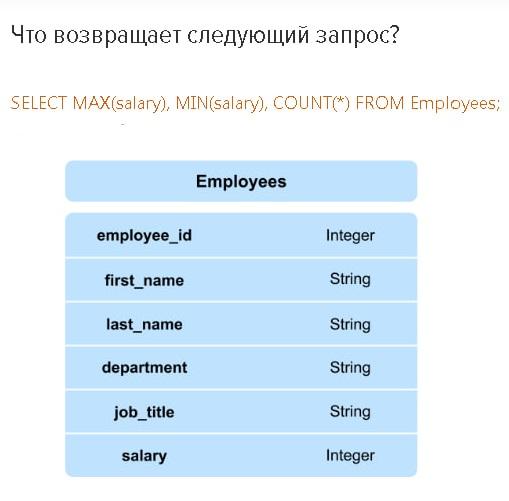

# Теория
# Вопросы и Ответы

В этом разделе представлены 10 изображений с вопросами. Нажмите на ответы, чтобы увидеть ответы и объяснения.

1. 
   

   
Ответ

   DROP TABLE (используется для удаления таблицы)
   

---
2. 
   

   
Ответ

   ALTER TABLE (используется для изменения структуры таблицы)
   
   DROP COLUMN (используется для удаления столбца)
   
   - ALTER TABLE Clients DROP COLUMN old_email;
   

---
3. 
   

   
Ответ

   
   - SELECT first_name, last_name FROM Employees WHERE job_title = 'Analyst' 
   
   

---
4. 
   

   
Ответ

   
   - Максимальную зарплату
   - Минимальную зарплату
   - Общее кол-во сотрудников (COUNT(*)) в таблице Employees
   
   

---
5. 
   

   
Ответ

   Уникальный id посетителя сайта
   
   Primary key или UNIQUE NOT NULL
   

---
6. 
   

   
Ответ

   
    Типы соединений существующие только в SQL:
   * INNER JOIN - возвращает только совпадающие записи из двух таблиц (Внутреннее)
   * OUTER JOIN - возвращает все записи из двух таблиц (Внешнее)
   * LEFT OUTER JOIN - возвращает все записи из левой таблицы и соответствующие записи из правой таблицы (Левый)
   * RIGHT OUTER JOIN - возвращает все записи из правой таблицы и соответствующие записи из левой таблицы (Правый)

   

---
7. 
   

   
Ответ

   
   (DESC тут играет роль сортировки по убыванию, то есть от большей к меньшей и от последней к первой)
   * SELECT * FROM Sales ORDER BY date DESC, sale_amount DESC;
   

---
8. 
   

   
Ответ

    
   Правильный ответ:
   
   * WHERE сначала выбирает строки, затем группирует их и вычисляет агрегатные функции, а HAVING — сначала группирует строки, вычисляет агрегатные функции и только потом выбирает строки

   WHERE используется для фильтрации строк до группировки данных. HAVING применяется для фильтрации после группировки, чаще всего с агрегатными функциями.
   
   

---
9. 
   

   
Ответ

   
   Чтобы найти регионы со средним рейтингом городов выше 3.0, используйте следующий SQL-запрос:
   
   - SELECT region_id, rating
   - FROM Cities
   - GROUP BY region_id
   - HAVING AVG(rating) > 3.0;

   

---

10. 
   

   
Ответ

   Первые 10 записей из таблицы Food, отсортированных по столбцу price в порядке убывания
   
   

---