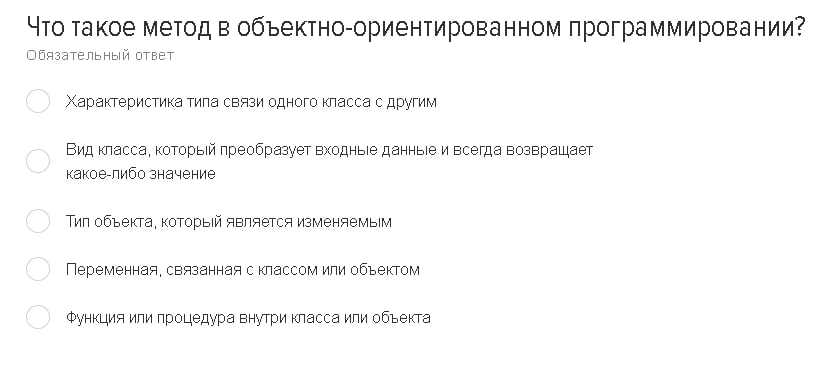
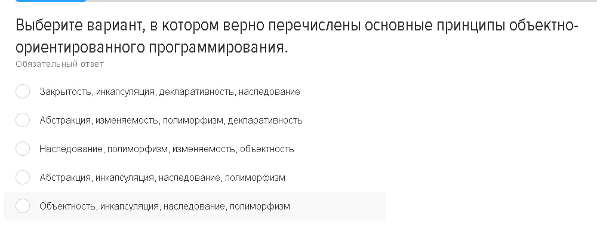
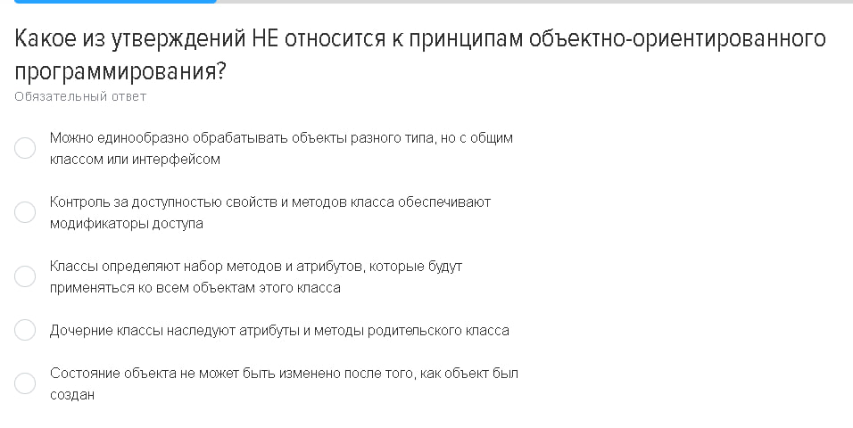
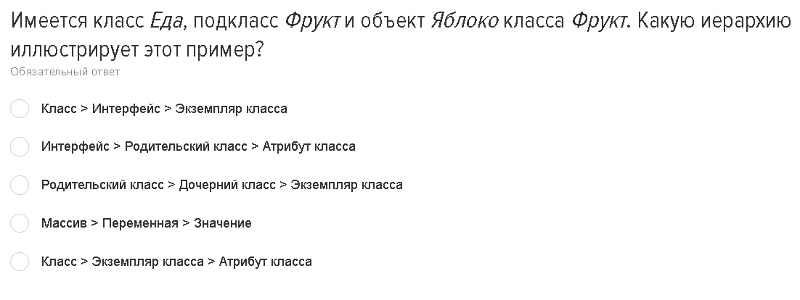
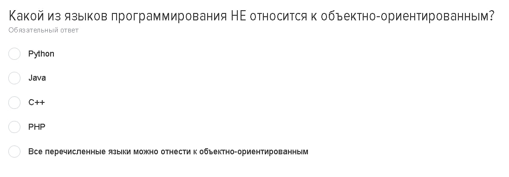
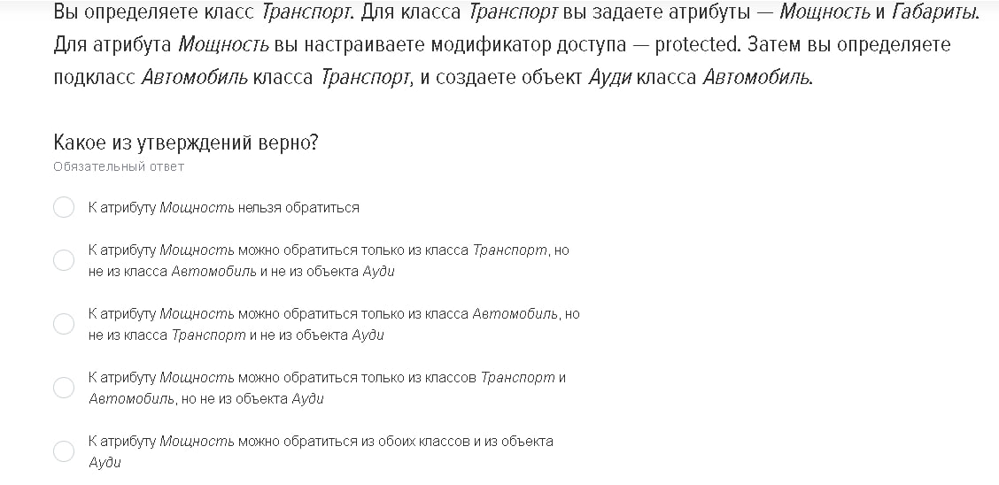
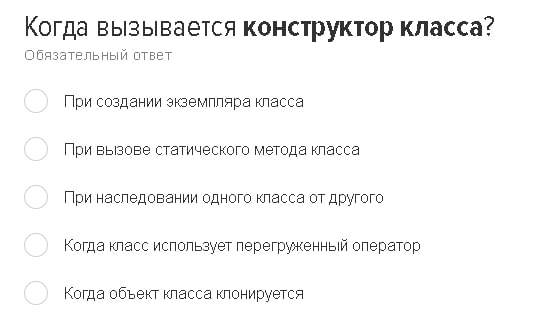
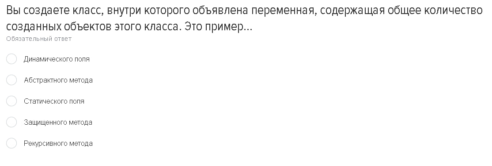

# Теория
# Вопросы и Ответы

В этом разделе представлены 9 изображений с вопросами. Нажмите на ответы, чтобы увидеть ответы и объяснения.

1. 
   

   
Ответ

   
   Метод в объектно-ориентированном программировании — это функция или процедура внутри класса или объекта.
   

---
2. 
   

   
Ответ

   Основные принципы ООП:
   
   - Абстракция - это процесс описания объекта с помощью абстрактных классов, интерфейсов и абстрактных методов.
   - инкапсуляция - это процесс ограничения доступа к данным и методам объекта, чтобы они были недоступны извне.
   - наследование - это процесс создания нового класса, который наследует свойства и поведение от родительского класса.
   - полиморфизм - это процесс изменения поведения объекта в зависимости от его типа.

   

---
3. 
   

   
Ответ

   
   Документ класса не должен иметь атрибуты, принадлежащие классу
   
   

---
4. 
   

   
Ответ

   Родительский класс > Дочерний класс > Экземпляр класса
   
   

---
5. 
   

   
Ответ

   Инкапсуляция
   

---
6. 
   

   
Ответ

   Все перечисленные языки можно отнести к ООП
    
   

---
7. 
   

   
Ответ

   К Атрибуту Мощность можно обратиться из обоих классов и из объекта Ауди
   

---
8. 
   

   
Ответ

    
   Конструктор класса вызывается при создании экземпляра класса (объекта)

   Конструктор класса по простому это метод

   

---
9. 
   

   
Ответ

   
   Это пример статического поля

   

---