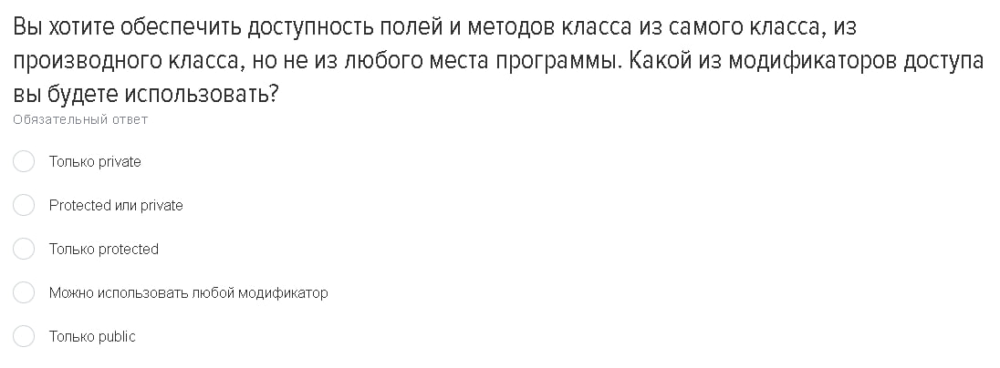

# Теория
# Вопросы и Ответы

В этом разделе представлены 12 изображений с вопросами. Нажмите на ответы, чтобы увидеть ответы и объяснения.

1. 
   

   
Ответ

   Класс - это шаблон, определяющий состояние и поведение объектов, объект - экземпляр класса
   

---
2. 
   

   
Ответ

   Антипаттерн в ООП - это применение одного и того же класса в различных контекстах
   
   Пример классического антипаттерна:
   - Использование класса с чрезмерно большим количеством методов, имеющих разное предназначение
   

---
3. 
   

   
Ответ

   Абстракция может достигаться путём использования интерфейсов, а инкапсуляция - за счёт модификаторов доступа
   
   

---
4. 
   

   
Ответ

   Статический полиморфизм - это способность класса изменять поведение его методов в зависимости от контекста
   
   - Когда в классе есть несколько методов, имеющих одинаковое имя, но различное количество параметров одного типа 
   

---
5. 
   

   
Ответ

   Принцип единственной ответственности В ООП - это принцип, который говорит о том, что каждый класс должен иметь только одну причину изменения
   (3 вариант)

   

---
6. 
   

   
Ответ

   Если программа была принудительно завершена 
    
   

---
7. 
   

   
Ответ

   
   - public - это публичный доступ к атрибутам и методам
   - protected - это защитный доступ к атрибутам и методам, который доступен только внутри класса и его подклассов
   - private - это приватный доступ к атрибутам и методам, который доступен только внутри класса
   (protected)
   

---
8. 
   

   
Ответ

    
   Принцип подстановки Барбары Лисков - это принцип, который говорит о том, что объекты, имеющие одинаковый интерфейс, должны иметь одинаковое поведение. 
   Одинаковый интерфейс - это интерфейс, который определяет методы, которые должны быть реализованы в классе
   

---
9. 
   

   
Ответ

   Когда необходимо хранить общее состояние классов-наследников то лучше использовать абстрактные классы.
   Интерфейсы лучше использовать для определения общего поведения.

   

---
10. 
   

   
Ответ

   (3 вариант)
   

---

11. 
   

   
Ответ

   
   Параметрический полиморфизм осуществляется в первую очередь через использование обобщённых классов

   

---
12. 
   

   
Ответ

   Проблема связанности - это проблема, которая возникает при использовании классов, которые зависят друг от друга.
   

---